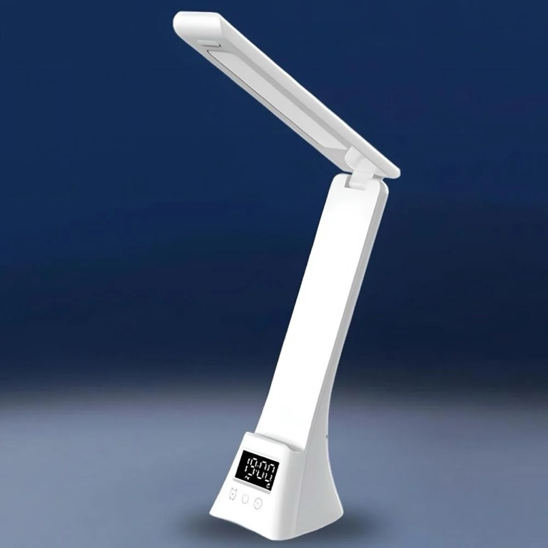
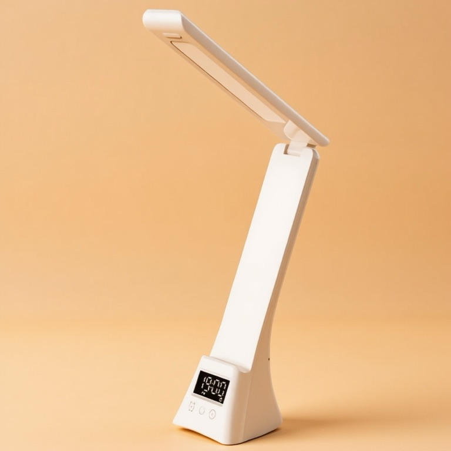
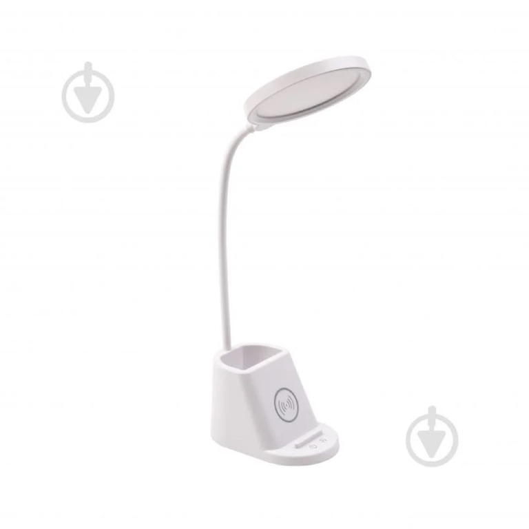
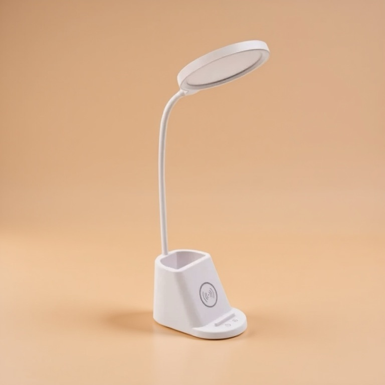
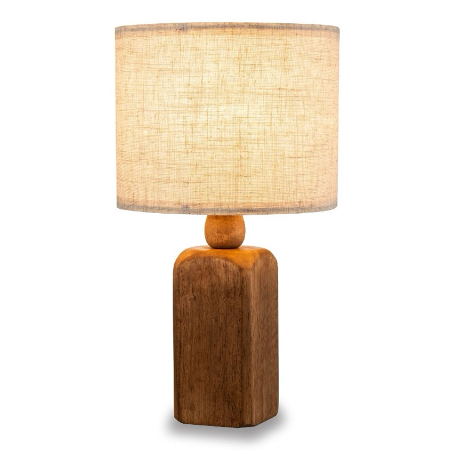

# Batch Creative Studio

Upload **N product images + 1–2 reference images**, hit **Generate**, and get **N social posts** styled to the reference — rendered **progressively** as each one lands. Built for reliability at scale: **retries, multi-provider failover, and a steady visual style** across the batch.

> Engineering-challenge submission. Stack: **Next.js (App Router) + Vercel · TypeScript · pnpm**. Single-user, no auth.

---

## Example — one batch, one consistent look

One **reference** sets the mood; three very different product photos come back as a cohesive set. The reference's mood is read **once per job** by a vision model, then each product is re-lit to match it — the product itself is left untouched.

**Reference (style / mood):**


> Mood the vision model extracted from it: *"soft, diffused lighting; warm, muted beige and creamy tones with a subtle golden warmth; a desaturated, slightly vintage grade; a simple, seamless backdrop; calm, minimalist, understated elegance."*

| Product image (input) | → | Generated post (output) |
|:---:|:---:|:---:|
|  | → |  |
|  | → |  |
|  | → |  |

Each product keeps its exact shape, materials, and controls — the clock display, the wireless-charging pad, the wood grain and linen shade — while the harsh blue / clinical-white backgrounds are replaced by the reference's warm, seamless mood. The **same** look lands on all three, which is the "steady visual style across every output" the brief asks for.

> Generated live through this app's pipeline (HuggingFace FLUX.1-Kontext). Free models vary run-to-run; this is a representative batch.

---

## Quick start

```bash
pnpm install
cp .env.example .env.local      # then fill in the keys below
pnpm dev                        # http://localhost:3000
```

**Minimum to generate (free):** a HuggingFace token. It powers both the product-preserving edit **and** the once-per-job reference-mood read; the chain falls over to Cloudflare automatically.

| Var | What | Where |
|---|---|---|
| `HF_TOKEN` | **Primary** — FLUX.1-Kontext img2img (preserves the product) **+** the vision model that reads the reference's mood | [hf.co/settings/tokens](https://huggingface.co/settings/tokens/new?ownUserPermissions=inference.serverless.write&tokenType=fineGrained) — fine-grained, "Inference Providers" permission |
| `CLOUDFLARE_ACCOUNT_ID` / `CLOUDFLARE_API_TOKEN` | Fallback — Workers AI | dash.cloudflare.com → Workers AI |
| `BLOB_READ_WRITE_TOKEN` | Uploads + results | Vercel → Storage → Blob (a **public** store) |
| `KV_REST_API_URL` / `KV_REST_API_TOKEN` | Shared state for multi-instance prod (optional locally) | Vercel → Storage → Upstash for Redis |
| `PROVIDER_CHAIN` | `huggingface,cloudflare` (default) | — |

> Adapters for **Gemini**, **Pollinations**, and **Replicate** also ship behind the same interface — off by default, drop-in via `PROVIDER_CHAIN`.

Then: drop in product photos + a reference, write a one-line brief (the scene/mood), **Generate**.

---

## How it works

```
Browser ── upload (signed, direct-to-Blob) ──► Vercel Blob
   │  POST /api/jobs (create N items, SSRF-checked, rate-limited)
   └─ GET /api/jobs/:id/stream (SSE) ──► hosts the orchestrator (Fluid Compute)
                                          │
        provider abstraction ◄── failover engine ◄── retry engine ◄── worker pool
        (Kontext → Cloudflare)        (backoff+jitter)   (bounded concurrency)
```

- **Provider abstraction** (`lib/providers`): every model is an `ImageProvider` adapter behind one interface. The **failover engine** (`lib/orchestrator/failover.ts`) consumes only that interface and advances the chain.
- **Reliability core**: retries with exponential backoff + jitter and error classification; per-provider token-bucket rate limiting; idempotent, last-writer-wins result keys; partial-failure aggregation (one bad item never sinks the batch).
- **Progressive rendering**: each result streams to its own tile over SSE the moment it's ready, with `Last-Event-ID` reconnect + snapshot recovery.
- **Shared state**: in-memory locally; **Upstash Redis** (env-gated) in production so any serverless instance sees the job.

Deep dives: [`docs/architecture.md`](docs/architecture.md) · [`docs/product-flow.md`](docs/product-flow.md) · decisions in [`docs/state/decisions.md`](docs/state/decisions.md) · per-component docs in [`docs/components/`](docs/components/).

---

## Providers — how generation actually works

The brief wants posts **styled to the reference** that **keep the product intact**. Each batch runs in **two steps, both on HuggingFace**:

1. **Read the reference's mood — once per batch.** A vision model (`google/gemma-3-27b-it`) describes the reference's *lighting, colour grade, and atmosphere* as a short paragraph of text, deliberately ignoring the objects in it (see the extracted mood in the example above).
2. **Edit each product — once per image.** FLUX.1-Kontext (a true image-**edit** model) takes the **product photo** and re-lights it to that mood. The product is the *only* image in the frame, so it stays exact; the reference's look arrives as the text from step 1.

**Failover.** Step 2 runs a chain — **HuggingFace Kontext → Cloudflare Workers AI** — so if HuggingFace is rate-limited or out of credit, the batch still finishes on Cloudflare. The order is one env var (`PROVIDER_CHAIN`); every model is an `ImageProvider` adapter behind a single interface, and adapters for Gemini, Replicate, and Pollinations ship too (off by default). If the step-1 vision read fails, the prompt simply falls back to the brief text — the batch never blocks on it.

### Why text, not the reference image — the judgment call

Kontext is **single-image**: it can't take a *second* image (the reference) as a style input. The obvious workaround — pasting product + reference **side-by-side** into one frame — I built and then **threw away**: Kontext kept ignoring the reference, copying its objects into the output, or returning a collage. Routing the mood through text is what makes the look **consistent across the whole batch** with **zero reference-leak** (nothing but the product is ever in the frame).

What each provider offers, and why the chain is what it is:

| Provider | Role | Preserves the product? | Cost |
|---|---|---|---|
| **HuggingFace FLUX.1-Kontext** | **Primary** — in the chain | ✅ true image-edit | small free credit, then ~¢/image |
| **Cloudflare Workers AI** | **Fallback** — in the chain | ⚠️ weaker composition | 10k neurons/day free |
| Gemini 2.5 Flash ("Nano Banana") | available, off by default | ✅ best — native multi-image | paid (free image limit = 0) |
| Pollinations `gptimage` | available, off by default | ❌ text-to-image (drops the product) | free |

Pixel-exact reference matching — copying the reference's *look* and not just its *mood* — would want a paid IP-Adapter / Gemini model, a one-env-var swap behind the same interface. For "match the mood" on a free budget, vision-to-text is the right call. Full reasoning in [`docs/state/decisions.md`](docs/state/decisions.md).

---

## What I built vs. deliberately left out

**In scope (and done):** upload + validation, batch generation with bounded concurrency, the reliability core (retries · **Kontext → Cloudflare failover**, proven live · partial-failure · targeted retry), **reference-mood transfer via once-per-job vision extraction → product-only edit**, progressive SSE rendering with reconnect, style consistency (shared prompt + per-batch seed + the same extracted mood across the batch), export (single + zip), editorial visual language, server-side secrets + SSRF guards + rate limiting, **Upstash Redis** shared state for multi-instance prod, and a Vercel deploy.

**Deliberately deferred (full-product scope, beyond this ~4-hour build):** auth/multi-user, batch history/permalinks, a durable queue (the SSE handler hosts orchestration in-flight), cross-instance SSE pub/sub for mid-batch reconnects, and enabling Replicate. Each is noted in `docs/state/decisions.md` with the reasoning — the point was a working, reliable batch with clear trade-offs, not gold-plating.

---

## Possible improvements / what I'd add next

Beyond the deferred infrastructure above, the things I'd reach for next — most are a small change behind the existing seams:

- **Pixel-exact reference matching.** Swap the primary to an image-conditioned model (Gemini "Nano Banana", or a FLUX Redux / IP-Adapter on Replicate) to copy the reference's exact *look*, not just its mood — one `PROVIDER_CHAIN` change behind the same `ImageProvider` interface.
- **Editable extracted mood.** Surface the vision model's mood text in the UI and let the user tweak it before generating, so the look is directly steerable.
- **Variant generation + auto-pick.** Generate 2–3 variants per product and surface the best (free models vary run-to-run), plus a one-click "regenerate this tile".
- **Per-image briefs in the UI.** The backend already accepts `perImageHints`; expose a per-product caption field.
- **Durable runs.** A real queue + persistence so a batch survives a redeploy or a closed tab, with batch history and shareable permalinks.
- **Cold-start mitigation + a small provider-health / usage panel**, and **end-to-end tests** (Playwright) over the upload → generate → render flow on top of the reliability-core unit tests.

---

## How this was built (AI tooling)

Built with **Claude Code**, scaffolded by **[Forgeline](https://github.com/nikita-voloshyn/forgeline)** — a Claude Code plugin I built that turns a project's spec + stack into a tailored multi-agent `.claude/` workspace (domain agents, skills, hooks, permissions) through a guided setup. The flow for this project:

1. **Spec first** — read the brief, then wrote the tech spec / architecture before any code ([`docs/architecture.md`](docs/architecture.md), [`docs/product-flow.md`](docs/product-flow.md)).
2. **Scaffold the team** — Forgeline's `/setup-agents` read that spec and generated a workspace tailored to it: domain agents (`frontend` / `backend` / `providers` / `testing` / `security-backend`) under a supervisor, each with a strict ownership boundary, plus a fresh-context `reviewer` and a `/plan → /assign → /execute` skill pipeline.
3. **Plan → assign → execute** — `/plan` decomposed the work into tasks with domain owners, `/assign` mapped agents + skills to each, and `/execute` ran them one at a time, with the `reviewer` re-reviewing from fresh context after every task and an adversarial multi-dimension review at the end.
4. **Verify + reconcile** — each task was gated on lint · types · 106 tests · build before moving on, and contract divergences caught by live testing (Vercel Blob's real upload API, the seed INT32 range, the free-provider reality, the side-by-side-stitch dead-end) were folded back into [`docs/state/decisions.md`](docs/state/decisions.md).

The full audit trail is in the repo: [`docs/plans/`](docs/plans/) (plan · dispatch · report), [`docs/reviews/`](docs/reviews/), and the [`docs/security/`](docs/security/) review.

---

## Verify

```bash
pnpm exec biome check .      # lint + format
pnpm exec tsc --noEmit       # types
pnpm exec vitest run         # 106 tests (reliability core: retry, failover, idempotency, adapters)
pnpm build                   # production build
```

Tests concentrate on the reliability core (deterministic, fake-provider-driven), matching the challenge's "test coverage matters less" weighting — they exist where a regression would actually hurt.

## Deploy

Vercel (`vercel --prod`). Set the env vars above on the project (the Blob + Upstash integrations inject theirs automatically). Fluid Compute keeps the SSE stream alive; the Blob store must be **public** (image URLs are rendered + fetched directly).

---

## Time spent

**~4 hours** of focused, AI-assisted engagement (Claude Code + Forgeline — see *How this was built* above), in order:

1. **~45 min** — analysing the brief and writing the tech spec / requirements.
2. **~25 min** — generating the multi-agent system with **[Forgeline](https://github.com/nikita-voloshyn/forgeline)**, tailored to that spec.
3. **~45 min** — the planning stage (`/plan` → `/assign`), wiring up the providers, and the overall architecture.
4. **~30–60 min** — Claude Code executing the plan (`/execute`).
5. **~60 min** — debugging and checking the output against the brief (the free-provider reality, the stitch dead-end → vision-to-text fix, the worked example, and the deploy).

## Repo map

```
app/ components/ lib/        — the app (UI · API routes · providers · orchestrator · state)
docs/architecture.md         — technical architecture
docs/product-flow.md         — end-to-end behavior / state machines
docs/state/decisions.md      — every load-bearing decision + trade-off
docs/components/             — per-component reference docs
docs/plans/ docs/reviews/    — the AI build audit trail
```
