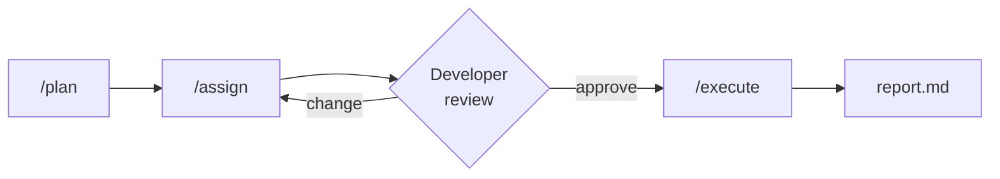

# Batch Creative Studio — Agentic System

> Auto-generated by [Forgeline](https://github.com/nikita-voloshyn/forgeline). Do not edit manually — re-run `/setup-agents` to regenerate.

## Overview

This document describes the multi-agent development system configured for **Batch Creative Studio**.

- **Stack:** TypeScript · Next.js (App Router) on Vercel (Fluid Compute, streaming Route Handlers, SSE) · pnpm · Vitest · Biome
- **Storage:** Vercel Blob (uploads + results); Postgres/Neon + KV/Upstash are full-product scope only
- **AI providers:** Gemini 2.5 Flash Image (primary) → Cloudflare Workers AI (secondary) → Replicate (optional tertiary), behind the `ImageProvider` abstraction
- **Auth:** None (single-user)
- **Development approach:** Iterative + Timeboxing
- **Orchestration topology:** Supervisor (central `dispatch` agent assigns tasks)

## Architecture

```mermaid
flowchart TD
    frontend["Frontend Agent\n(sonnet)"]
    backend["Backend Agent\n(opus)"]
    providers["Providers Agent\n(opus)"]
    testing["Testing Agent\n(sonnet)"]
    docs["Docs Agent\n(sonnet)"]
    reviewer["Reviewer Agent\n(sonnet)"]
    dispatch["Dispatch Agent\n(sonnet)"]
    security["Security (Backend) Agent\n(opus)"]

    frontend --> fe_app["app/ client UI (excl. app/api/)"]
    frontend --> fe_comp["components/**"]
    frontend --> fe_sse["SSE client + reconnect"]

    backend --> be_api["app/api/**"]
    backend --> be_orch["orchestrator + worker pool"]
    backend --> be_retry["retry engine (backoff+jitter)"]
    backend --> be_fail["failover ENGINE (consumes ImageProvider)"]
    backend --> be_stream["SSE server stream"]

    providers --> pr_lib["lib/providers/** (ImageProvider + adapters)"]

    testing --> te_test["**/*.test.ts + fake provider"]

    docs --> dc_comp["docs/components/ + coverage.md"]
    reviewer --> rv_rev["docs/reviews/"]
    dispatch --> di_dis["docs/plans/*-dispatch.md"]
    security --> se_sec["docs/security/** + SECURITY.md (review-only)"]
```



## Agents

### Frontend Agent

- **Model:** `sonnet`
- **Domain:** Client UI — uploader (product + reference), params form, batch grid (progressive tiles), SSE client + reconnect, visual language
- **File:** `agents/frontend.md`

**Owns:**
- `app/` — client UI (pages, layouts, Server + Client Components), excluding `app/api/`
- `components/**`
- the SSE client and reconnect logic
- the client batch store (Zustand / React state)
- the visual language / styling

**Forbidden from:**
- `app/api/**`
- `lib/providers/**`
- the orchestrator, retry engine, rate limiter, SSE server stream, failover engine
- `**/*.test.ts`

**Verification:**
- `pnpm exec biome check .`
- `pnpm exec tsc --noEmit`

---

### Backend Agent

- **Model:** `opus`
- **Domain:** Route Handlers, job orchestrator, retry engine, worker pool, per-provider rate limiter, SSE server stream, blob upload signing, in-memory state store, failover engine
- **File:** `agents/backend.md`

**Owns:**
- `app/api/**` — Route Handlers (uploads, jobs, snapshot, SSE stream, retry)
- the job orchestrator (worker pool, bounded concurrency)
- the retry engine (exponential backoff + jitter, error classification)
- the per-provider rate limiter (token bucket)
- the SSE server stream (event bus → `ReadableStream`)
- blob upload signing (Vercel Blob)
- the in-memory state store (job / item / attempt)
- the failover ENGINE — consumes the `ImageProvider` interface only

**Forbidden from:**
- `components/**` and the client UI / SSE client
- `lib/providers/**` — the provider adapter implementations
- `**/*.test.ts` and the fake provider

**Verification:**
- `pnpm exec biome check .`
- `pnpm exec tsc --noEmit`
- `pnpm exec vitest run`

---

### Providers Agent

- **Model:** `opus`
- **Domain:** `lib/providers/**` — the `ImageProvider` interface and Gemini / Cloudflare / Replicate adapters, provider/model/quota config, reference-image normalization
- **File:** `agents/providers.md`

**Owns:**
- `lib/providers/**` — the `ImageProvider` interface and all adapters
- the Gemini adapter (Gemini 2.5 Flash Image / "Nano Banana")
- the Cloudflare Workers AI adapter (FLUX.2 klein / FLUX.1 schnell / SDXL)
- the Replicate adapter (FLUX + Redux/IP-Adapter)
- provider / model / quota configuration
- reference-image normalization

**Forbidden from:**
- `app/api/**`
- `components/**`
- the failover ENGINE, orchestrator, retry engine, rate limiter
- `**/*.test.ts`

**Verification:**
- `pnpm exec biome check .`
- `pnpm exec tsc --noEmit`
- `pnpm exec vitest run`

---

### Testing Agent

- **Model:** `sonnet`
- **Domain:** Test suite — unit tests (retry engine, failover, adapters), integration tests, the fake/mock provider for deterministic reliability tests
- **File:** `agents/testing.md`

**Owns:**
- `**/*.test.ts`
- test fixtures
- the fake / mock `ImageProvider` with controllable failures (timeout / 429 / fatal)

**Forbidden from:**
- all production source code (`app/**`, `components/**`, `lib/**` outside test files)
- provider adapter internals, the failover engine, the orchestrator
- agent / skill definitions and `.claude/`

**Verification:**
- `pnpm exec vitest run`
- `pnpm exec vitest run --coverage`
- `pnpm exec biome check .`

---

### Dispatch Agent

- **Model:** `sonnet`
- **Domain:** Task assignment — assign agents and skills to planned tasks, produce dispatch files
- **File:** `agents/dispatch.md`

**Owns:**
- `docs/plans/*-dispatch.md`

**Forbidden from:**
- source code, configuration files, agent definitions, skill definitions, `.claude/`

**Verification:**
- Every task from the plan has exactly one agent assigned
- No circular dependencies between groups

---

### Reviewer Agent

- **Model:** `sonnet`
- **Domain:** Fresh-context post-task review — read the diff, plan, and dispatch; surface defects; auto-invoked by `/execute` after each implementer task
- **File:** `agents/reviewer.md`

**Owns:**
- `docs/reviews/`

**Forbidden from:**
- all source code under any implementer agent's `owns`
- agent / skill definitions, `.claude/`, configuration files, `docs/plans/`

**Verification:**
- `git diff --stat docs/reviews/`

---

### Docs Agent

- **Model:** `sonnet`
- **Domain:** Documentation coverage — maintain `docs/components/` and `docs/coverage.md`
- **File:** `agents/docs.md`

**Owns:**
- `docs/components/`
- `docs/coverage.md`

**Forbidden from:**
- source code (`app/`, `lib/`, `components/`), `docs/plans/`, agent / skill definitions, `.claude/`, configuration files

**Verification:**
- `git diff --stat docs/components/`

---

### Security (Backend) Agent

- **Model:** `opus`
- **Domain:** Review-only server security and threat modeling — SSRF (top priority), input validation on upload + job creation, rate limiting of `POST /api/jobs`, secret/API-key handling, file-upload safety, sensitive-data logging. No auth surface (single-user).
- **File:** `agents/security-backend.md`

**Owns:**
- `docs/security/**`
- `SECURITY.md`
- threat-model files (e.g., `docs/security/threat-model-backend.md`)

**Forbidden from:**
- `app/api/**` and all production source (review only — mirrors the `backend` agent's `owns`)
- `components/**`, `lib/providers/**`, `lib/**`, `**/*.test.ts`
- agent / skill definitions, `.claude/`, configuration files

**Verification (review commands, not fixes):**
- `npx semgrep --config p/owasp-top-ten --severity=ERROR --severity=WARNING .`
- `pnpm audit --audit-level=high`
- `grep -rn 'API_KEY\|SECRET\|TOKEN\|PRIVATE_KEY\|Bearer ' app lib --include='*.ts' | grep -v '.env.example'`

---

## Concurrency model

This system follows a **single-writer rule**: for any one task, exactly one implementer agent writes code. Other agents may research, review, or advise — they may not write to the same files.

| Role | What it does | How many per task |
|------|--------------|-------------------|
| Implementer | Writes code, configuration, migrations | exactly 1 |
| Fresh-context reviewer | Auto-invoked by `/execute` after every implementer task; reads the diff with no prior context, writes findings to `docs/reviews/` | exactly 1 (the `reviewer` agent) |
| Reviewer (ad hoc) | Reads diffs on developer request, flags issues, no writes to implementer's files | 0 or more |
| Researcher / advisor | Reads docs, queries Context7, returns findings | 0 or more |
| Security (review-only) | `security-backend` reviews the server surface; owns `docs/security/` | 0 or more |

Rationale: parallel writer agents make implicit, conflicting decisions about style, edge cases, and module boundaries. Splitting a task and letting one agent own each split keeps the codebase coherent. The most important split for this project: the **failover engine** is owned by `backend` and only consumes the `ImageProvider` interface; the **adapters** are owned by `providers`. A task that touches both must be split — never assign both as co-implementers.

This rule is enforced at three levels:

1. `/plan` — splits tasks so each has exactly one domain owner.
2. `/assign` — refuses to assign two implementers to the same task; flags ambiguity for the developer.
3. The `dispatch` agent — when two candidate implementers exist, picks one and routes the others to review-only.

## Development Workflow

Feature development follows a structured pipeline:



1. **`/plan`** — Collaboratively decompose a feature into tasks with domain assignments
2. **`/assign`** — Assign agents and skills to each task, review and approve
3. **`/execute`** — Execute tasks sequentially, verify each, run a fresh-context review after each implementer task, produce a report

All artifacts are saved in `docs/plans/` as an audit trail. Each skill is opt-in.

## Documentation Layer

The docs agent maintains `docs/components/` as a fast-access reference for all project components. Before reading source files to understand a component:

1. Run `/docs status` to check coverage health
2. Read `docs/coverage.md` to find the component's doc file
3. Read the component's doc file in `docs/components/`

Reading source is a fallback for undocumented or stale components only.

| Operation | When to use |
|-----------|-------------|
| `/docs audit` | After major feature work — scan all components, fill gaps |
| `/docs update <path>` | After modifying a specific source file |
| `/docs status` | Quick health check before starting work |
| `/setup-approach` | Change the development approach in CLAUDE.md |

The development approach can be reconfigured at any time using `/setup-approach`. The approach reference file at `docs/approaches-reference.md` contains all available approaches.

---

## Skills

| Skill | Purpose |
|-------|---------|
| `/check` | Run the full quality pipeline: lint, typecheck, tests |
| `/changelog` | Generate a session changelog from git diff |
| `/phase` | Execute the current phase from the development plan |
| `/deploy-check` | Pre-deployment audit: quality, secrets, deps, build |
| `/plan` | Plan a feature: decompose into tasks with domain assignments |
| `/assign` | Assign agents and skills to a plan's tasks |
| `/execute` | Execute an approved dispatch task by task |
| `/docs` | Maintain documentation coverage |
| `/setup-approach` | Change the development approach in CLAUDE.md |
| `/observability` | Configure OpenTelemetry export to a tracing backend |

## Hooks

### PostToolUse — Auto-lint

Triggers after every file edit (`Edit|Write|MultiEdit`). Activates once Biome is configured in the project (`pnpm install` + a `biome.json`).

```
pnpm exec biome check --write "$CLAUDE_FILE_PATH" 2>/dev/null || true
```

### Stop — Secrets Scan

Triggers at session end.

```
grep -rn 'API_KEY\|SECRET\|PASSWORD\|PRIVATE_KEY\|TOKEN\|Bearer ' --include='*.ts' --include='*.tsx' --include='*.js' . 2>/dev/null | grep -v node_modules | grep -v '.env.example' | grep -v '.next' | head -20 && echo '[Forgeline] Review any matches above for hardcoded secrets' || true
```

## Permissions

### Allow (`.claude/settings.local.json`)

- `Bash(git:*)`
- `Bash(gh pr:*)`
- `Bash(pnpm:*)`
- `Bash(npx:*)`
- `Bash(node:*)`
- `Bash(vercel:*)`

### Deny (`.claude/settings.json`)

- `Read(.env)`
- `Read(.env.*)`
- `Read(secrets/**)`
- `Read(~/.ssh/**)`
- `Write(.env)`
- `Write(.env.*)`

## Plugins

- **context7** (mandatory) — up-to-date framework/library/SDK documentation via `resolve-library-id` → `query-docs`. Every agent and skill defers to it before making framework decisions.
- **typescript-lsp** — TypeScript language-server intelligence (go-to-definition, diagnostics) for the codebase.
- **code-simplifier** — always-recommended pass to simplify and refine recently modified code while preserving behavior.
